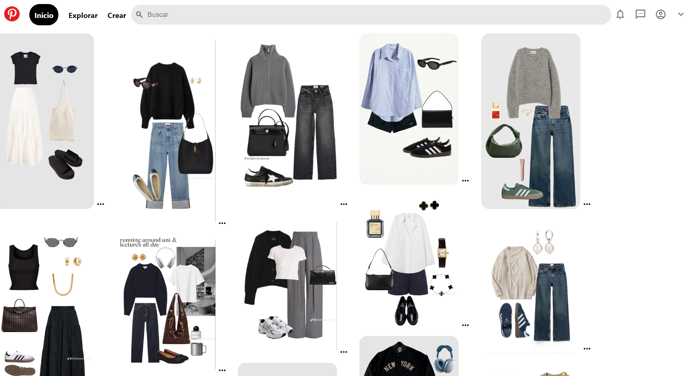

# Images interface using HTML and CSS

Front-end project where I emulated a popular webpage UI design coded with HTML 5 and CSS 3 as part of my first bootcamp project in the field.

The main purpose of the project is to replicate the visual apperaence of Pinterest, offering a similar navigation experience with a responsive design and basic functionalities. The intention is not to copy the platforms design or product design but to practice my HTML and CSS skills.

### Characteristics
* Responsive design
* Screen adaptability for a better user interface experience
* Emulation of the original design only for educational purposes

If you would like to work on a project together send me a message on my [LinkedIn] profile(https://www.linkedin.com/in/jessica-romero-lora/)

Preview of the project

